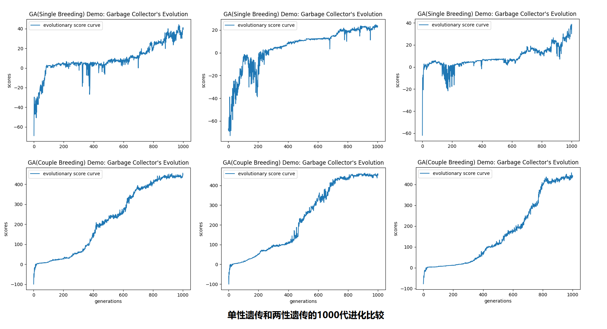
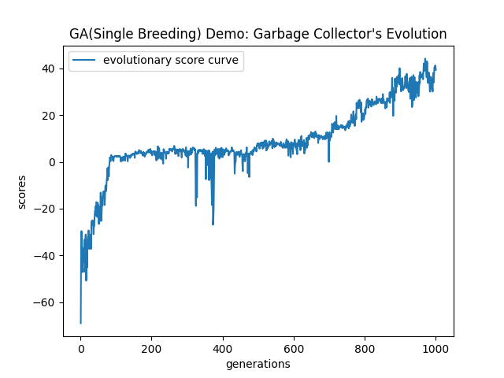
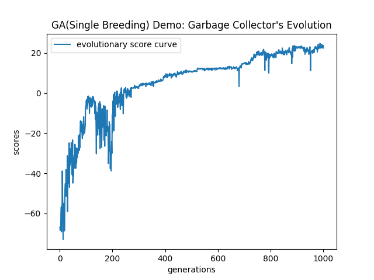
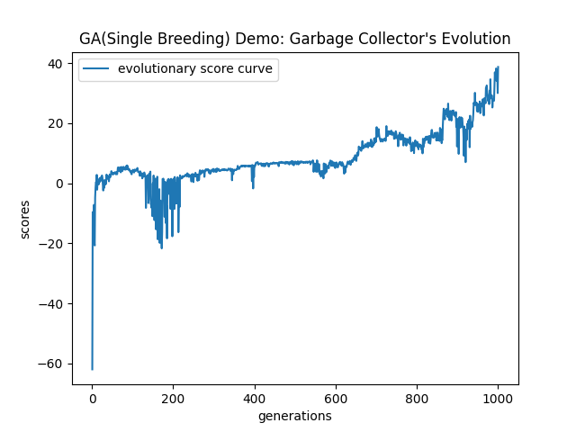
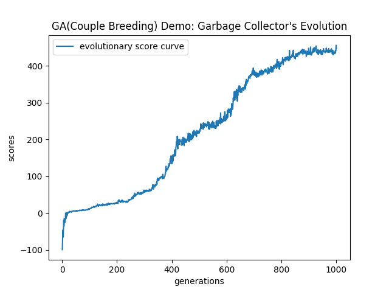

# readme

下面说的有不正确的地方，请大家指正。

## 一些理解

复杂系统，在我理解，用P-NP相关术语来描述的话，应该属于NPH问题。我们在解决NP/NPC/NPH问题时，单纯使用数学方法是需要十分巨大的计算量的，这在目前来看是不现实的（以后量子计算可能会实现这种计算量）。目前解决NP/NPC/NPH问题的主流方式（就现实实际的问题，请忘掉编程竞赛常用的动态规划），是对基于统计学的模型进行梯度下降（Gradient Descent）来逼近这些问题的答案或者规则，目前最流行也是最成熟的就是机器学习/深度学习模型；遗传算法可以看作是目前另外一种解决NP/NPC/NPH问题的次主流方式（我觉得比梯度下降更优美），看了一些综述论文，其平级或衍生的算法还有蚁群、退火、蛙跳等；还看到论文描述用遗传算法来解决深度学习模型的超参优化问题。

## 背景说明

最近在研读侯世达的学生梅拉妮·米歇尔写的《复杂》（英文原版名为《Complexity：A Guided Tour》）这本书。这本书算是通俗科普书，但在系统性的描述复杂系统上，我觉得比我以前看的复杂相关的书都要更系统和更全面（虽然我看的复杂相关的书其实并不算多），但有一些可能是翻译导致的小瑕疵。

在书中，有一章节专门写了遗传算法，而我一直想要实现的一个算法目前已经被我定位于关联遗传算法的微观表现算法，所以就按照这本书上提到的一个小应用实现了这个项目，以更深的了解遗传算法和复杂思想。项目实现和书中应用有些小差异，比如我缩小了种群数量；变异率书中没提，我试了0.1和0.01，后来查看了一些论文，遗传算法普遍公认的遗传算法变异率是0.01和0.005；双性繁殖的基因杂交算法可能和作者实现的有小差异（书中没细说如何实现）。另外我就兴趣和临时起意，实现了单性繁殖和两性繁殖的1000代进化比较（有个长辈朋友提到病毒是单性繁殖的，可能是最近新冠病毒引起的疫情，才让我临时起意实现单性繁殖的吧）。

## 代码说明

需要跑在python 3.x环境下，具体依赖包请参看代码部分，需要额外安装的只有matplotlib和numpy吧。

tools.py: 包含了几个使用的工具类

- Strategy: 策略，其中包括了基因数量、基因映射索引表、动作
- Square：广场，其上随机有垃圾，Collector可以在Square上收集垃圾
- BreedingWay：繁殖方式的基类，所有具体繁殖方式都要从此类继承
- SingleBreeding: 单性繁殖方式，通过选取上一代最优Collector个体，指定变异几率后，随机生成本代；此方式在命令行被编码为1
- CoupleBreeding：双性繁殖方式，从上一代所有Collector中按照score高低作为概率选取两个Collector，然后通过拼接这两个Collector的基因生成本代；此方式在命令行被编码为2
- Collector：垃圾回收机器人，每个Collector有不同的基因，通过BerrdingWay指定的繁殖方式繁殖后代

run.py: 运行算法的入口文件，在项目根目录下运行命令如下（因为在Linux平台上python命令默认指向python2，所以下面的命令需要把python变为python3）：

```bash
python ./run.py [required - breeding way: 1-single breeding; 2-couple breeding] [optional - processor number, default: 8]
```

比如我要用12个进程跑双性繁殖，在linux上的话就执行如下指令：

```bash
python3 ./run.py 2 12
```

## 实验记录

**环境大小（长x宽）：** 10x10
**不同的环境数量：** 100个
**机器人基因数量：** 162个
**机器人单位基因表达不同指令最大个数：** 7个
**机器人数量：** 100个
**机器人一次行动步数：** 200步
**遗传代数：** 1000代

### 2021年10月20日

**遗传方法：** SingleBreedingx2
**变异率：** 0.1
**结果：** 50代后看到没有收敛趋势，且发散范围扩大，因为运行时间较长（当时未支持多进程，运算速度较慢），故中止

### 2021年10月21日

**遗传方法：** SingleBreedingx3，CoupleBreedingx3
**变异率：** 0.01
**结果：** 明显收敛（已支持多进程，运算速度较快）。单性繁殖普遍收敛的较慢，且较不稳定，1000代后适应环境的分数在25-45之间，离理想值500还很远；两性繁殖普遍收敛的较快，且较稳定，1000代后适应环境的分数在440-460之间，接近理想值500



上图中每个小图放大后如下：







## 一些小的结论

这里就零散的写一些小结论：

- 无论单性繁殖还是双性繁殖，基因异变率不能高，比如超过1%；基因异变率高得话，整个种群进化是很不稳定的，会比较容易的被环境淘汰
- 双性繁殖生物比单性繁殖生物的进化更快、更稳定，且在一定时间内对环境的适应度更高
- 相同环境下，单性繁殖生物的初始代的生存能力比双性繁殖生物要高
- 一旦环境发生巨变，双性繁殖生物的适应性会迅速下降，即生存能力会急速减低，单性繁殖生物在环境巨变下生存能力应该更强
